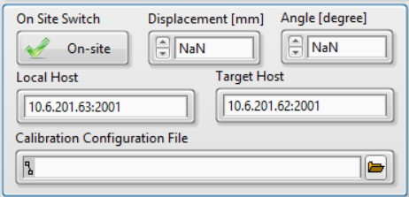

.. calibration

On-site Calibration
===================

On-site Settings
----------------
The On-site settings are enabled by swithing on the ``On Site Switch``.

- ``Displacement``: Change the distance of the rotational mirror to the beam expansion part.
- ``Angle``: Change the angle of the rotational mirror.
- ``Local Host``: The IP and port for the local UDP service.
- ``Target Host``: The IP and port of the remote **second pulse generator**.
- ``Calibration Configuration File``: The automatic calibration script.

.. note::
    When ``Displacement`` and ``Angle`` have the value of ``NaN``, the rotational mirror will stay in the current position.

Calibration Configuration File
------------------------------
The calibration file holds a list of job setups. Each line is treated as a job. The job paramerters are separated by comma in the following definations:

.. code-block:: bash

    Date Time, Duration, Displacement, Angle

Below is an example of the configuration file.

.. code-block:: bash
    
    2024-11-23 10:20, 10, 10, 10
    2024-11-25 15:59, 10, 10, 10
    2024-11-25 16:01, 20, 0, 0
    2024-11-25 16:03, 30, 10, 30

Calibration Procedure
----------------------

----------------------
Hardware Preparation
----------------------
- Connect the **hot source** and heat it up.
- Connect the cables of the step motors to the **step motor controller**'s corresponding DB9 sockets.

    + The DB9 socket in the main FTS part should be connected to ``X``.
    + The DB9 socket of the linear step motor in the beam reflection part should be connected to ``Y``.
    + The DB9 socket of the rotational step motor in the beam reflection part should be connected to ``Z``.

- Connect the COM port of the **step motor controller** to the PC's COM port or use a USB-to-COM cable for transformation.
- Make sure the **step motor controller** is in ``Remote`` mode.
- Connect the socket of LE in the main FTS part to the **DAQ box**.
- Connect the USB cable of the **DAQ box** to the PC.
- Connect the **second pulse generator** to the PC with network cable.
- Connect the trigger and pulse cable of the **second pulse generator** to the **DAQ box**.

------------------
Manual Calibration 
------------------
The following procedures are used to perform a single calibration manually.

- Open the application ``FTS.exe``.
- Select and set ``SM Controller``.
- Select ``Reciprocating`` mode.
- Set ``Loop Number``.
- Change ``Max Pos`` to adjust spectra resolution. 
- Confirm ``Linear Encoder Name`` is valid and with ``ctr0`` selected.
- Switch on ``On Site Switch``.
- Change mirror positons by setting ``Displacement`` and ``Angle``.
- Select ``Trigger Source`` if you want the job is fired by the **second pulse generator**.
- Click ``Start``.

------------------------
Automatic Calibration 
------------------------
The procedures are generally similar to :ref:`Manual Calibration` but with the ``Calibration Configuration File`` being set.

- Open the application ``FTS.exe``.
- Select and set ``SM Controller``.
- Select ``Reciprocating`` mode.
- Change ``Max Pos`` to adjust spectra resolution. 
- Confirm ``Linear Encoder Name`` is valid and with ``ctr0`` selected.
- Switch on ``On Site Switch``.
- Select the ``Calibration Configuration File``.
- Select ``Trigger Source``.
- Click ``Start``.

.. note::
    ``Loop Number`` is no long valid, since the job is stopped by **Duration** in the calibration configuration file.
