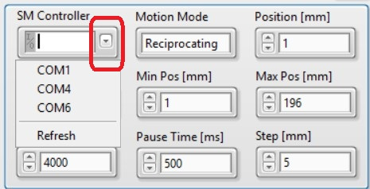

.. introduction

Introduction
===================

----------
Hardware
----------
The hardware of the FTS system consists of main FTS, beam expansion and beam reflection parts.

The main FTS part
------------------
This part contains the moving and static roof-top mirrors,  linear stepped motor (holding the moving mirror), beam spliter, concave mirror, and the black-body source.

The beam expansion part
-----------------------
This part contains two concave mirrors to expand the beam size outputted from the main FTS part.

The beam reflection part
------------------------
This part contains one big reflection mirror, whose distance to the beam expansion part is controlled by a linear stepped motor and angle is controlled by a rotational motor.

-----------
Software
-----------
The software of the FTS system is developed using LabVIEW™ with `actor framework <https://labviewwiki.org/wiki/Actor_Framework>`_ architecture. The application includes the main, step motor (SM), linear encoder (LE), DAQmx, data saver, data viewer and UDP actors. Below is its main GUI interface.

Step Motor Settings
-------------------
The most import thing is to choose the COM port connected to the step motor controller. If the controller is connected to the default COM port of the PC running the FTS application, choose ``COM1``, otherwise choose the one that disappears when the USB-to-COM cable is unplugged. After ``SM Controller`` is set, you'll hear the motion of resetting all linear and rotational motors.

.. warning::
    Please make sure that the step motor controller is set with **remote** mode.

- ``Motion Mode``
    + ``Reciprocating``: The moving mirror will move from ``Min Pos`` to ``Max Pos`` and return (does not stop in between). Normally for on-site calibration.
    + ``Stepping``: The moving mirror will move step by step from ``Min Pos`` to ``Max Pos`` stopped after moving every ``Step``. Normally for carrying lab tests.
- ``Min Pos``: The minimum position of the motion.
- ``Max Pos``: The maximum position of the motion.
- ``Loop Number``: The total circles of the motion. Can be set to half value, i.e., ``1.5``, the moving mirror will move one and half circles without return to ``Min Pos``.
- ``Position``: Manually move the moving mirror to ``Position``. Don't forget to press enter after the input.
- ``Pause Time``: The time duration to wait before moving to the next step in ``Stepping`` mode.

Linear Encoder Settings
------------------------
The linear encoder is necessary to acquire the positon of the moving mirror in real time for on-site calibraiton ( ``Reciprocating`` mode). 

- ``Linear Encoder Name``: If the default name of the USB DAQ device is not ``Dev1``, one should manually change the value and select ``ctr0`` under the USB DAQ device.
- ``LE Clock Source``: The clock source for DAQ of the linear encoder.
- ``LE Sampling Rate``: Make sure the value is the same as specificed in ``LE Clock Source``.
- ``Distance Per Pulse``: Usually should not be changed. However, If the measured positon is not consistent with the difference between ``Max Pos`` and ``Min Pos``, one can change this value for correction.
- ``Trigger Source``: If not empty, the DAQ task is controlled by the external trigger.
- ``Trigger Timeout``: The DAQ task will be terminated if the external trigger does not send a electrical pulse.

.. warning::
    ``LE Clock Source`` and ``LE Sampling Rate`` must be consistent. Otherwise application will raise an error complaining about clock source. 

DAQmx Settings
---------------
The FTS application supports DAQ of other external analog voltage signals that connected to the USB DAQ device.

.. note::
    The external signals are acquired in concurrence with the linear encoder. So, DAQmx shares the same trigger as LE.

- ``DAQmx Channels``: The ``Saving Name`` will be used to set the channel name in the TDMS file under ``DAQmx`` group. If you want to acquire more than two channels, just increase the index on the left for inputing more channels.

On-site Settings
-----------------
Refer to :ref:`On-site Calibration`.

Data Saver Settings
-------------------
The data of the application is saved under ``Data Saving Folder``. One can set ``Data File Suffix`` to add the suffix of the file name. The content of ``Comments`` of the file will also be saved into the data file.

